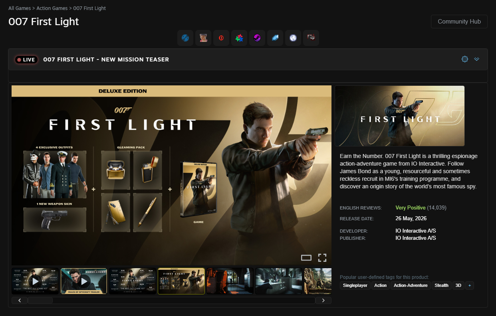
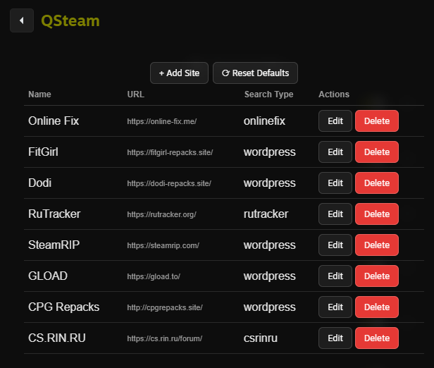

<h1 align="center">QSteam-Millennium</h1>

> [!CAUTION]
> **Do not ask for help or mention piracy on the official Steam Client Homebrew Discord server, otherwise you will be banned!**

<h2 align="center">Description</h2>

QSteam is a plugin for the Millennium custom Steam client. It adds quick-access buttons to any game's page that redirect to piracy sites, allowing you to quickly find and install the specific game you are currently viewing.

<table>
  <tr>
    <td></td>
    <td></td>
  </tr>
</table>

<h2 align="center">Configuration</h2>

You can customize the plugin by navigating to:  
**Millennium > Plugins > QSteam > Configure**

In the settings, you can:
* Add new sites to the list.
* Edit existing site URLs.
* Remove sites you don't need.

*Note: Websites like RuTracker and CS.RIN.RU require an active account to access downloads.*

<h2 align="center">Installation</h2>

1. Install Millennium: [Getting Started](https://docs.steambrew.app/users/getting-started/installation).
2. Download `QSteam-MIL_vX.X.zip` from the [Releases](../../releases) page.
3. Extract the downloaded archive.
4. Move the extracted plugin folder into your `plugins` directory.  
   *(Tip: You can easily open this folder by going to **Steam > Millennium > Plugins > Browse local files**)*.
5. Restart Steam.  
   *(If needed, enable the plugin in the Millennium menu, then click **Save Changes** > **Reload Now**)*.

<h2 align="center">Credits</h2>

The original idea belongs to [iMAbound](https://github.com/iMAboud) - [iMSteam-Millennium](https://github.com/iMAboud/iMSteam-Millennium).

<h2 align="center">License</h2>

This project is licensed under the **GPLv3** License.
